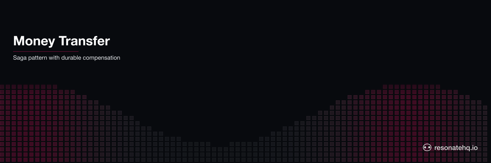

<p align="center">
  <picture>
    <source media="(prefers-color-scheme: dark)" srcset="./assets/banner-dark.png">
    <source media="(prefers-color-scheme: light)" srcset="./assets/banner-light.png">
    
  </picture>
</p>

<p align="center">
  <a href="https://resonatehq.github.io/examples-ci/">
    
  </a>
</p>

# Money Transfer

**Resonate Python SDK**

Move funds between two accounts as a saga — debit, credit, and on a credit-side failure, run a compensating debit-reversal. Each step is durable and idempotent, so a worker crash mid-transfer never leaves the ledger in a half-applied state.

## What this example demonstrates

- **Saga pattern.** A multi-step business operation written as straight-line Python, with compensation triggered when a step fails.
- **Durable steps.** Each `await ctx.run(...)` call is a checkpoint. If the worker crashes after the debit but before the credit, Resonate replays from the last successful checkpoint.
- **Idempotency.** Ledger entries are keyed by a deterministic operation id (`{transfer_id}-debit`, `{transfer_id}-credit`, `{transfer_id}-reversal`) and inserted with `INSERT OR IGNORE`. Replays apply the entry once and only once.
- **Explicit compensation.** When the credit step raises, the workflow catches the exception and runs the reversal — also durable, also idempotent.

## How the saga is wired

```text
                 transfer_money workflow
                        │
                        ▼
        ┌──────────────────────────────────┐
        │ 1. apply_entry  source  -amount  │   debit (checkpoint)
        └────────────────┬─────────────────┘
                         │
                         ▼
        ┌──────────────────────────────────┐
        │ 2. credit_target   target  amount│   credit (checkpoint)
        └────────────────┬─────────────────┘
                         │ on raise
                         ▼
        ┌──────────────────────────────────┐
        │ 3. apply_entry  source  +amount  │   compensating reversal
        └──────────────────────────────────┘
```

Each numbered box is a durable checkpoint. Steps 1 and 3 reuse the same `apply_entry` function — the difference is just the sign of the amount and the operation id.

## How to run

This example requires a running Resonate server. Install the Resonate CLI and start the server:

```shell
resonate dev
```

This starts the server on port 8001 by default. In a separate terminal, install dependencies and run the demo:

```shell
uv sync
uv run main.py
```

The demo connects to `http://localhost:8001` by default. Override with the `RESONATE_URL` environment variable:

```shell
RESONATE_URL=http://my-server:8001 uv run main.py
```

You'll see two transfers: one happy path that commits, and one where the credit is configured to fail so the saga compensates. The closing balances show that `alice` is left correctly debited only by the committed transfer.

Sample output:

```text
opening balances: alice=200.0 bob=0.0

[saga] transfer transfer-1719000000000000000: alice -> bob  $50.0
  [ledger] transfer-1719000000000000000-debit:  alice -50.0  // debit
  [ledger] transfer-1719000000000000000-credit: bob +50.0    // credit
[saga] transfer transfer-1719000000000000000 committed

[saga] transfer transfer-1719000000000001000: alice -> bob  $75.0
  [ledger] transfer-1719000000000001000-debit: alice -75.0   // debit
[saga] credit failed: target account 'bob' rejected the credit. Compensating...
  [ledger] transfer-1719000000000001000-reversal: alice +75.0 // reversal

closing balances: alice=150.0 bob=50.0
(the second transfer was compensated, so alice ends at 200 - 50 = 150)
```

## Files

- [`main.py`](./main.py) — the saga workflow, the SQLite ledger helpers, and a small demo driver.
- [`pyproject.toml`](./pyproject.toml) — pins `resonate-sdk>=0.7.0`.

## How it works

### Idempotent ledger entries

```python
async def apply_entry(ctx, op_id, account, amount, note=""):
    db = ctx.get_dependency(sqlite3.Connection)
    cursor = db.execute(
        "INSERT OR IGNORE INTO transfers (uuid, account, amount, note) "
        "VALUES (?, ?, ?, ?)",
        (op_id, account, amount, note),
    )
    return op_id
```

The `uuid` column is the table's primary key. `INSERT OR IGNORE` makes a replay of the same step a no-op — the row is already there, the balance already reflects it.

### The saga, written as straight-line code

```python
async def transfer_money(ctx, source, target, amount, *, simulate_credit_failure=False):
    transfer_id = ctx.info.id
    debit_id    = f"{transfer_id}-debit"
    credit_id   = f"{transfer_id}-credit"
    reversal_id = f"{transfer_id}-reversal"

    await ctx.run(apply_entry, debit_id, source, -amount, "debit")

    try:
        await ctx.options(retry_policy=Never()).run(
            credit_target, credit_id, target, amount,
            fail=simulate_credit_failure,
        )
    except Exception as err:
        await ctx.run(apply_entry, reversal_id, source, amount, "reversal")
        return {"status": "compensated", "error": str(err)}

    return {"status": "committed", ...}
```

`retry_policy=Never()` is intentional on the credit step: this saga's compensation IS the response to a credit-side failure. In production you'd typically allow a few retries first (network blips happen) and only compensate after the upstream has clearly rejected the credit.

### Registering a dependency

```python
r = Resonate(url=url)
r.with_dependency(db)          # register the sqlite3.Connection
r.register(transfer_money)     # register the workflow function
```

Inside a step, retrieve the dependency by type:

```python
db = ctx.get_dependency(sqlite3.Connection)
```

### Running a workflow

```python
result = await r.run(unique_id, transfer_money, source, target, amount).result()
```

`r.run(...)` returns a handle immediately. `.result()` is an awaitable that resolves when the workflow completes.

### Account balances

Balances aren't stored — they're computed by summing the ledger:

```sql
SELECT COALESCE(SUM(amount), 0) FROM transfers WHERE account = ?
```

This makes the ledger the single source of truth. A reversal entry undoes a debit by adding the equivalent positive amount; the saga's correctness reduces to "the ledger reflects every committed step."

## Related

- [example-money-transfer-application-ts](https://github.com/resonatehq-examples/example-money-transfer-application-ts) — the TypeScript port (HTTP API + same saga shape).
- [Resonate Python SDK](https://github.com/resonatehq/resonate-sdk-py)
- [Resonate docs](https://docs.resonatehq.io)
